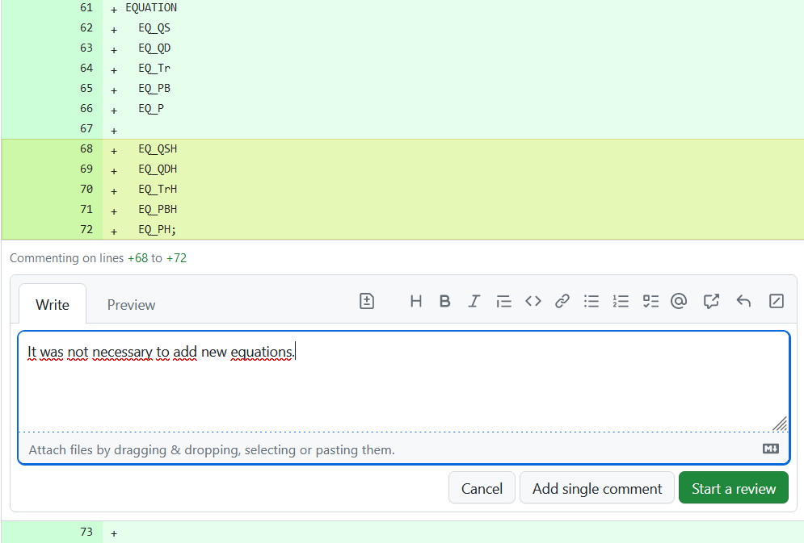
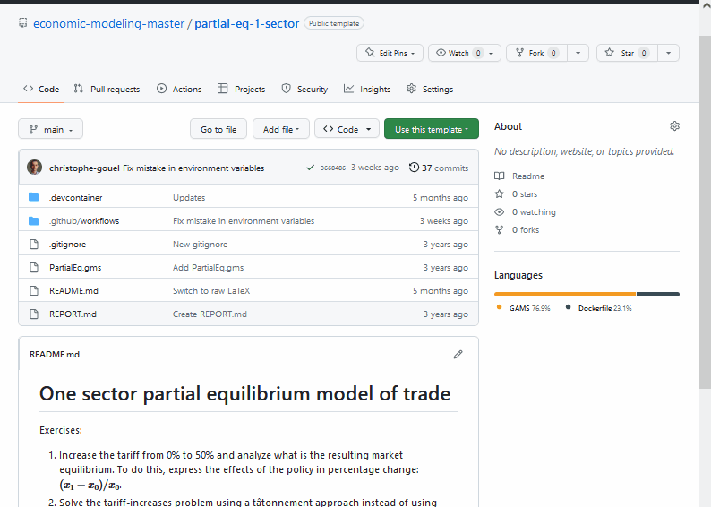

Are you ready to transform your GAMS modeling class with modern tools and streamline grading? In this blog post, I'll show you how I have recently adjusted my own workflow.

As a teacher of a master-level course on General Equilibrium Modeling, I know the importance of practice for students to master the subject. I give many exercises to students, some of which they do in class with my help, and others they do on their own and submit for grading. However, receiving over 20 programs to check for each session was daunting. In this blog post, I will show you how I turned this dreaded work into a streamlined, efficient process.

To achieve this, I use [GitHub Classroom](https://classroom.github.com/), which is a free service provided by GitHub for teachers to manage assignments using GitHub repositories. I also use [continuous integration workflow in GitHub](https://docs.github.com/en/actions/automating-builds-and-tests/about-continuous-integration) to automatize the execution of GAMS programs and [cloud-based development tools](https://docs.github.com/en/enterprise-cloud@latest/codespaces/developing-in-codespaces) for providing feedbacks.

To make this concrete, I have created a public repository with an introductory exercise that I use in my class as an example. You can find it here: <https://github.com/economic-modeling-master/partial-eq-1-sector>.

# GitHub Classroom

Using GitHub Classroom, I can manage all assignments and have access to a dashboard that presents each class, assignment, and student repository. When I send out an assignment, students are given a link that creates a repository copied from a target repo for them to submit their solutions. GitHub Classroom makes grading assignments more efficient, as it allows teachers to see all students' repositories for a particular assignment and check whether they have submitted their work before the deadline. Assignments can be done individually or in group, and in the latter case one repo is created per group.

From the students' perspective, using GitHub Classroom just requires a GitHub account, but no installation or knowledge of Git. Without using Git, they can submit their assignments simply by uploading files manually as on any other website, in which case a commit is automatically created. So it is not limited to computer science classes and students skilled enough to learn GAMS can use it without trouble.

GitHub Classroom includes features to automatize grading. For example, by running unit tests on students code, but this does not seem adapted to GAMS programs. However, I build on similar tools to automatize the run of students' solutions.

# Automatic run of students solutions

Once all students have committed their solutions to their respective repositories, I use a continuous integration workflow in GitHub to run all their GAMS programs without having to do it manually. After each student commit, a virtual machine is launched with a fresh GAMS install to run all `.gms` files present in the repository. The output files (`gdx`, `log`, and `lst`) are saved in a zip file for me to check as shown in this gif:


If their `gms` file does not compile, instead of a green checkmark (<span style="color:green">✓</span>) indicating compilation, there is a red cross mark (❌). In this case, I know that I have to check their code to find the mistake, which I can also do in the cloud using cloud-based development tools.

The automatic execution of GAMS is triggered by having a YAML file with the correct instructions in each repository. You can find an example of such a YAML file in [workflow.yml](https://github.com/economic-modeling-master/partial-eq-1-sector/blob/main/.github/workflows/workflow.yml).
<details>
  <summary>Click for details of workflow.yml</summary>
  
```{yaml}
name: Test model solution with GAMS

on: [push]
jobs:
  build:
    runs-on: ubuntu-latest
    container: gams/gams:latest
    steps:
      - name: Checkout
        uses: actions/checkout@v3
      - name: Run GAMS
        run: |
          cd $GITHUB_WORKSPACE
          for gmsfile in *.gms
          do
            gams "${gmsfile}" lo=4 gdx="${gmsfile/.gms/}"
            cat "${gmsfile/gms/lst}"
          done
        shell: bash
      - name: Archive results
        uses: actions/upload-artifact@v3
        with:
          name: gams-results-files
          path: |
            ./*.lst
            ./*.log
            ./*.gdx
```
</details>

# Fixing students errors and providing feedbacks

In case of errors in students' code, I use GitHub's Pull Request interface to propose solutions and provide feedbacks. The Pull Request interface allows me to comment on code line by line, which is perfect for fixing minor errors.



For more complex errors, it might be necessary to change the code and launch GAMS to check the new solution. I could download the code to modify it on my computer before uploading back the corrected version, but this would add a lot of frictions. Instead, I am relying on [Codespaces](https://github.com/features/codespaces) which allows me to start a virtual machine in the cloud. The difference with the previous virtual machine that automatically launched GAMS is that Codespaces provides a persistent machine with an editor (Visual Studio Code for the Web), a terminal to launch GAMS, and a link to the original repo to push back modifications (contrary to what the gif below may suggest setting up the Codespaces takes about 2 minutes, during which I jump to another project to grade).



# How to deal with licensing?

GAMS requires a license to run. But, with [GAMS version 44.0](https://www.gams.com/latest/docs/RN_44.html#g4410_LICENSE), a demo license is included back in the GAMS distribution. It is valid for approximately 5 months, which is enough given the frequent GAMS releases, as long as one uses the latest GAMS distribution. For the purpose of this class, where the students have to solve small models, relying on the demo license [with its limits](https://www.gams.com/latest/docs/UG_License.html#UG_License_Additional_Solver_Limits) is normally sufficient, but this may not be the case for everyone.

If you need to use a license file, I can see at least two approaches. The first would be to store a license file in each repository of assignments and to move it automatically to where GAMS is installed on the virtual machine. Since, for my class, the repositories for exercises are all private repositories, the license would not been shared outside the class and each year, GAMS provides me with a temporary teaching license for my students. For public projects, storing the license file is not an option. In this case, the license can be stored in a [GitHub secret](https://docs.github.com/en/actions/security-guides/encrypted-secrets) and copied to GAMS folder after the installation.

# Additional benefits

Even if this setup does not require the students to learn how to use Git, it has the benefit of familiarizing them with modern development tools: GitHub, Markdown, Continuous Integration, and even development in the cloud; all skills that can be useful for modelers in and out of academia.

Another benefit of this approach is that it can be scaled up. Running the class with a hundred students would not be more difficult. It is possible to share the teacher access to GitHub Classroom with teaching assistants who would take care of part of the load.

In conclusion, by using modern tools, you can transform the way you teach GAMS modeling and make grading more efficient and partly automated.
