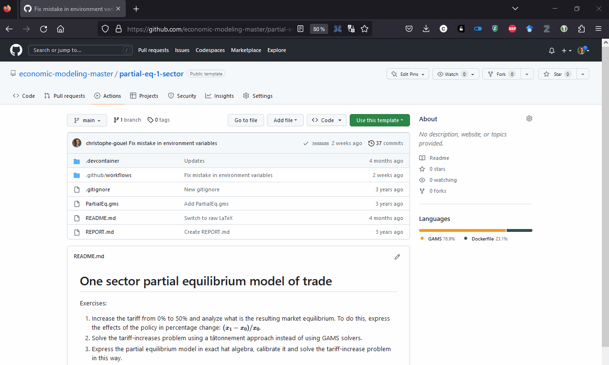

Teaching modeling with GAMS involves practice. In my master-level class, *Introduction to General Equilibrium Modeling*, I give many exercices to the students, some that they have to do in classes and that I help them with, and some that they have to do between sessions and that they send me for grading. While the part where they work on their own to figure out solutions to their problems is important, receiving before the new class session 20 or more programs that will have to each be run separately to check whether they run as expected was something I dreaded. In this blog post, I will explain how I turn this dreaded work into something that is partly automatized and that can be done very efficiently.

To achieve this, I have been combining [GitHub Classroom](https://classroom.github.com/), [continuous integration workflow in GitHub](https://docs.github.com/en/actions/automating-builds-and-tests/about-continuous-integration), and tools for [developing in the cloud](https://docs.github.com/en/enterprise-cloud@latest/codespaces/developing-in-codespaces).

To make more concrete what I will expose, I have made available in a public repository the introductory exercise I use in my class and that I will use here as example: <https://github.com/economic-modeling-master/partial-eq-1-sector>.

# GitHub Classroom

GitHub Classroom is a service provided by GitHub that uses GitHub repositories for 

Using it does not require any knowledge of Git by the students. They can submit their assignments simply by uploading files manually as on any other website, in which case a commit is automatically created. So

# Automatic run of students solutions

Once all students have committed their solution on their respective repositories, I can have a look at what they have done. For this part, I don't want to have to run all their GAMS programs locally. So, I have set up a continuous integration workflow in GitHub: after each commit a virtual machine is launched with a fresh GAMS install that runs the `gms` files present in the repo. All output files (`gdx`, `log`, and `lst`) are saved in a zip file for me to check as shown in this gif:



If their `gms` file does not compile, instead of a green checkmark (<span style="color:green">✓</span>) indicating compilation, there is a red cross mark. In this case, I know that I have to go check their code to find the mistake, which I also do in the cloud as explained below.

The automatic execution is triggered by having in a repo a Yaml file with the right instructions. Here it is the file [workflow.yml](https://github.com/economic-modeling-master/partial-eq-1-sector/blob/main/.github/workflows/workflow.yml):
<details>
  <summary>Click for details of `workflow.yml`</summary>
```{yaml}
name: Test model solution with GAMS

env:
  GAMS_MAJOR: 29
  GAMS_MINOR: 1
  GAMS_MAINT: 0

on: [push]
jobs:
  build:
    runs-on: ubuntu-latest
    steps:
      - uses: actions/checkout@v3
      - name: Install GAMS
        run: |
          cd ~
          wget -nv https://d37drm4t2jghv5.cloudfront.net/distributions/${GAMS_MAJOR}.${GAMS_MINOR}.${GAMS_MAINT}/linux/linux_x64_64_sfx.exe
          chmod 755 linux_x64_64_sfx.exe
          ./linux_x64_64_sfx.exe
          echo "~/gams${GAMS_MAJOR}.${GAMS_MINOR}_linux_x64_64_sfx" >> $GITHUB_PATH
      - name: Run GAMS
        run: |
          for gmsfile in *.gms
          do
            gams "${gmsfile}" lo=4 gdx="${gmsfile/.gms/}"
            cat "${gmsfile/gms/lst}"
          done
      - name: Archive results
        uses: actions/upload-artifact@v3
        with:
          name: gams-results-files
          path: |
            ./*.lst
            ./*.log
            ./*.gdx
```
</details>

# How to deal with licensing?

One issue I encountered when developing this approach was GAMS licensing. I will tell you about the solution I adopted, but also about two other possible approaches. My solution is very simple: use GAMS 29.1. Now if you want to try GAMS without buying it, you have to request online a free demo license, but up to GAMS version 29.1 the demo version was shipped with the software and small models could be solved directly after the installation without having to provide a license. For the purpose of this class, where the students have to solve small models and, usually, do not use recently-introduced advanced GAMS features, relying on an old version of GAMS is largely sufficient.

If GAMS 29.1 is not recent enough, it is possible to use a license file. I can see at least two approaches. The first would be to store a license file in each repository of exercises and to move it to where GAMS is installed on the virtual machine. Since, for my class, the repositories for exercises are all private repositories, the license would not been shared outside the class and each year, GAMS provides me with a temporary teaching license for my students. For public projects, storing the license file is not an option. In this case, the license can be stored in a [GitHub secret](https://docs.github.com/en/actions/security-guides/encrypted-secrets) and copied to GAMS folder after the installation.

# Additional benefits

Even if this setup does not require the students to learn how to use Git, it has the benefit of familiarizing them with modern development tools: GitHub, Markdown, Continuous Integration, and even development in the cloud; all skills that can be useful for modelers in and out of academia.

Another benefit of this approach is that it can be scaled up. Running the class with a hundred students would not be more difficult. It is possible to share the teacher access to GitHub Classroom with TAs that would take care of part of the load.
